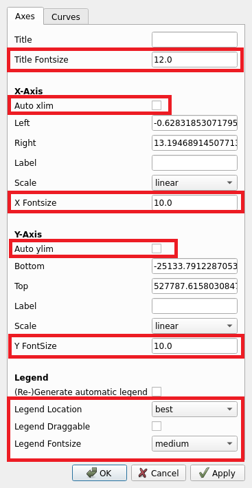
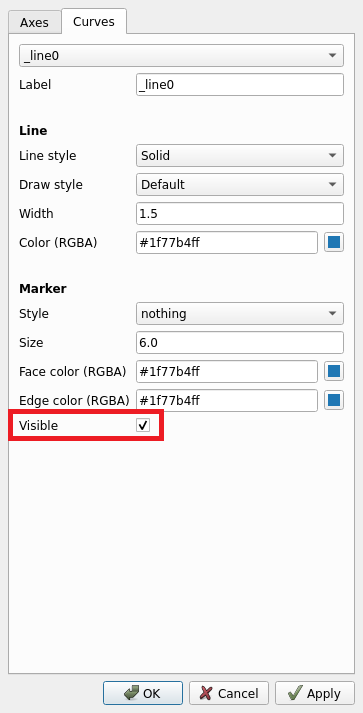

# Matplotlib Advanced Figure Options
Advanced figure options for when matplotlib.pyplot.show() is called

## Usage

After importing matplotlib, import mplAdvancedOptions
```
    import matplotlib.pyplot as plt
    import mplAdvancedOptions
```
The mplAdvancedOptions.py will overwrite the original matplotlib show options.

All the original options are still included in mplAdvancedOptions.

When **matplotlib.pyplot.show()** is used after plotting, this toolbar will be on the canvas.


The button surrounded by a red box contains axes and line options

## Axes Options



The new available options on this tab include:

1. Title fontsize - Change the fontsize of figure title
1. Auto xlim - When checked, will automate x-limits based on currently visible plotted curves
1. X Fontsize - Change the fontsize of the x-label
1. Auto ylim - When checked, will automate y-limits based on currently visible plotted curves. Useful after turning outlier plots invisible
1. Y Fontsize - Change the fontsize of the y-label
1. Legend Location - Location to put the legend if (Re-) Generate automatic legend is checked
1. Legend Draggable - Enable mouse dragging of the legend if enabled
1. Legend Fontsize - Change fontsize of legend

## Plotted Curve Options



New available options on this tab include:

1. Visible - Make curve invisible if unchecked

## Troubleshooting

* If the configure button doesn't appear, make sure Qt5Agg is being used as the backend.
    * If not, add "backend: Qt5Agg" to the matplotlibrc